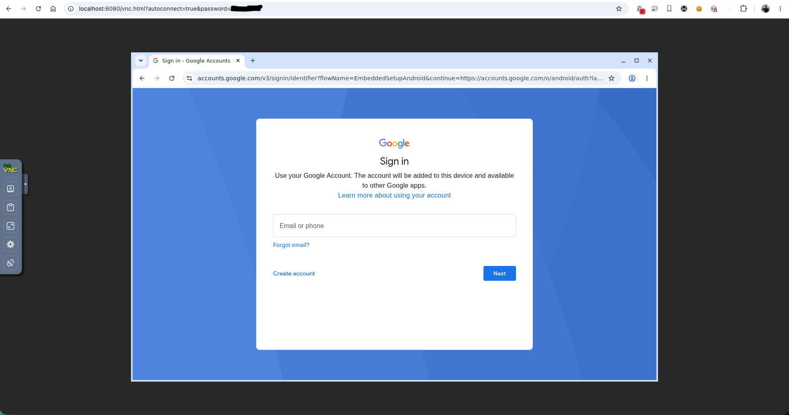
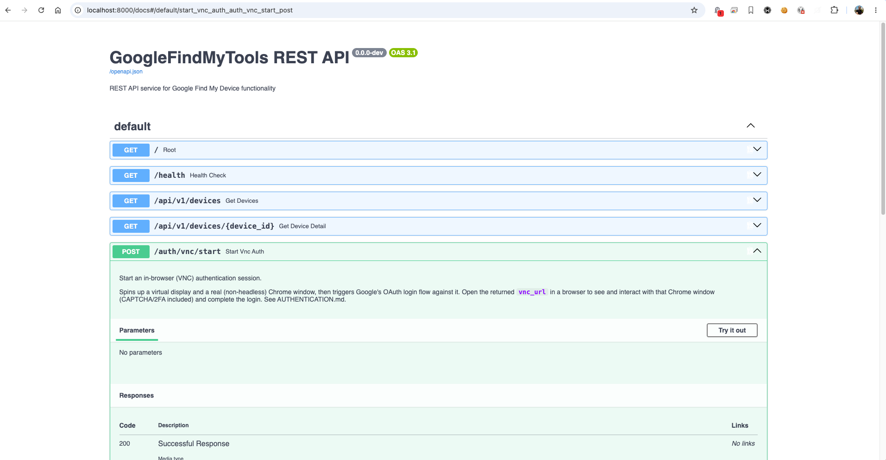

# Find My Device REST API Service

A REST API service that exposes Google Find My Device functionality using the [GoogleFindMyTools](https://github.com/leonboe1/GoogleFindMyTools) library. Standalone - usable with anything that can make HTTP calls.

> Deploying a pre-built image via Portainer, or cutting a new release? See [RELEASING.md](RELEASING.md).

## Table of Contents

- [Features](#features)
- [API Endpoints](#api-endpoints)
- [Prerequisites](#prerequisites)
- [Setup and Installation](#setup-and-installation)
- [Usage Examples](#usage-examples)
- [Response Examples](#response-examples)
- [Configuration](#configuration)
- [Troubleshooting](#troubleshooting)
- [Development](#development)
- [Security Considerations](#security-considerations)
- [Disclaimer](#disclaimer)
- [License](#license)
- [Credits](#credits)

## Features

- **List all devices**: Get a list of all devices registered in Google Find My Device with last seen timestamps
- **Device details**: Get detailed information for a specific device including:
  - Real-time location data (latitude, longitude, accuracy)
  - Device metadata (model, image URL, identifier type)
  - Last seen timestamp
  - Device status
- **Automatic location updates**: Background task that fetches device locations every 5 minutes (can be disabled)
- **Automatic API documentation**: Interactive API docs at `/docs` (Swagger UI) and `/redoc` (ReDoc)
- **Health checks**: Built-in health check endpoint for monitoring
- **Intelligent caching**: 60-second cache for device list, 5-minute cache for locations
- **Docker support**: Easy deployment with Docker and docker-compose
- **Synology NAS compatible**: Runs like any other Docker host via Docker Compose

## API Endpoints

| Endpoint                      | Method | Description                    |
| ------------------------------ | ------ | ------------------------------ |
| `/`                            | GET    | API information and available endpoints |
| `/health`                      | GET    | Health check                   |
| `/api/v1/devices`              | GET    | List all devices               |
| `/api/v1/devices/{device_id}`  | GET    | Get device details             |
| `/auth/vnc/start`              | POST   | Start an in-browser (VNC) login session - see [AUTHENTICATION.md](AUTHENTICATION.md#method-3-authenticate-via-browser-vnc---no-local-chrome-needed) |
| `/auth/vnc/status`             | GET    | Check the VNC login session's progress |
| `/auth/vnc/stop`               | POST   | Tear down the VNC login session |
| `/docs`                        | GET    | Interactive API docs (Swagger) |
| `/redoc`                       | GET    | Alternative API docs (ReDoc)   |

`/health` returns `200` with
`{"status":"healthy","message":"Service is running normally"}` when initialized
correctly, or `503` with `{"status":"unhealthy","message":"<specific reason>"}`
when it isn't (e.g. `secrets.json` missing/invalid) - the message names the actual
cause, not just "unhealthy". The container itself stays up either way, so this is
safe to check without risking a crash-loop.

## Prerequisites

### For Docker Deployment (Recommended)

- Docker
- Docker Compose
- Google Account with Find My Device enabled
- **Note**: Chromium browser is included in the Docker image (works on both ARM64 and AMD64)

### For Local Development

- Python 3.11+
- Chromium or Google Chrome (required for authentication)
- Google Account with Find My Device enabled

## Setup and Installation

> **On a Synology NAS?** This runs like any other Docker host - no NAS-specific
> steps needed. Either deploy [`docker-compose.portainer.yml`](docker-compose.portainer.yml)
> through Portainer (see [RELEASING.md](RELEASING.md) for how to redeploy new
> versions - Synology's own Container Manager "check for update" badge doesn't
> reliably track images managed this way), or follow Option 1 below directly
> over SSH.

### Option 1: Docker Deployment (Recommended)

1. **Create auth data directory**:

   ```bash
   mkdir -p auth_data
   ```

2. **First-time authentication** (required before running the service):

   Since the service needs to authenticate with Google, you need to run the authentication process first. Choose one of the following methods:

   #### Method 1: Authenticate Outside Docker (Recommended)

   This method is easier and more reliable as it allows you to use your system's Chrome browser for authentication:

   ```bash
   # Install Python dependencies (one-time setup)
   pip3 install -r GoogleFindMyTools/requirements.txt

   # Run authentication script (will open Chrome on your system)
   cd GoogleFindMyTools
   python3 main.py
   ```

   Follow the on-screen instructions:

   - Press Enter when prompted
   - Chrome will open automatically
   - Log in to your Google account
   - Grant permissions to the application
   - Complete any 2FA if enabled
   - Wait for the script to complete

   After successful authentication, copy the secrets file to the Docker volume:

   ```bash
   # Copy authentication file to Docker volume
   cp Auth/secrets.json ../auth_data/

   # Return to the project root
   cd ..
   ```

   #### Method 2: Authenticate Inside Docker (Advanced)

   This method runs authentication in a headless browser inside Docker:

   ```bash
   # Build the image
   docker-compose build

   # Run authentication in interactive mode
   docker compose run --rm -w /app/GoogleFindMyTools find-my-device-rest-api python main.py
   ```

   **Note**: This method uses headless Chrome inside Docker, which may have limitations with certain authentication flows (e.g., CAPTCHA, advanced 2FA). If you encounter issues, use Method 1 or Method 3 instead.

   The authentication data will be saved in `./auth_data/secrets.json`.

   #### Method 3: Authenticate via Browser (VNC) - No Local Chrome Needed

   Full CAPTCHA/2FA support like Method 1, but entirely through the container -
   nothing to install locally, nothing to copy over. See
   [AUTHENTICATION.md](AUTHENTICATION.md#method-3-authenticate-via-browser-vnc---no-local-chrome-needed)
   for the full walkthrough; the short version:

   ```bash
   docker compose up -d
   curl -X POST http://localhost:8000/auth/vnc/start   # returns a vnc_url + password
   # open vnc_url in a browser, log in, then:
   curl http://localhost:8000/auth/vnc/status           # watch for "succeeded" - no restart needed
   ```

   Opening `vnc_url` drops you straight into a live view of the Chrome window
   running inside the container, already on Google's login page:

   

3. **Start the service**:

   ```bash
   docker-compose up -d
   ```

4. **Check service status**:

   ```bash
   docker-compose ps
   docker-compose logs -f find-my-device-rest-api
   ```

5. **Access the API**:
   - API: http://localhost:8000
   - Interactive docs: http://localhost:8000/docs
   - Health check: http://localhost:8000/health

   Every endpoint (including `/auth/vnc/start` and the others above) is
   documented in the Swagger UI at `/docs`:

   

### Option 2: Local Development

1. **Clone GoogleFindMyTools**:

   ```bash
   git clone https://github.com/leonboe1/GoogleFindMyTools.git
   ```

2. **Create virtual environment**:

   ```bash
   python -m venv venv
   source venv/bin/activate  # On Windows: venv\Scripts\activate
   ```

3. **Install dependencies**:

   ```bash
   pip install -r requirements.txt
   ```

4. **Authenticate with Google** (first time only):

   ```bash
   cd GoogleFindMyTools
   python main.py
   ```

   Follow the authentication process. This will create `GoogleFindMyTools/Auth/secrets.json`.

5. **Run the API service**:

   ```bash
   cd ..
   python -m uvicorn app.main:app --host 0.0.0.0 --port 8000 --reload
   ```

6. **Access the API**:
   - API: http://localhost:8000
   - Interactive docs: http://localhost:8000/docs

## Usage Examples

### Using curl

**List all devices**:

```bash
curl http://localhost:8000/api/v1/devices
```

**Get device details**:

```bash
curl http://localhost:8000/api/v1/devices/{device_id}
```

**Health check**:

```bash
curl http://localhost:8000/health
```

### Using Python

```python
import requests

# List all devices
response = requests.get('http://localhost:8000/api/v1/devices')
devices = response.json()
print(f"Found {len(devices)} devices")

# Get device details
device_id = devices[0]['device_id']
response = requests.get(f'http://localhost:8000/api/v1/devices/{device_id}')
device_detail = response.json()
print(f"Device: {device_detail['name']}")
print(f"Location: {device_detail['location']}")
print(f"Battery: {device_detail['battery_level']}%")
```

### Using JavaScript/Node.js

```javascript
// List all devices
fetch("http://localhost:8000/api/v1/devices")
  .then((response) => response.json())
  .then((devices) => {
    console.log(`Found ${devices.length} devices`);

    // Get details for first device
    const deviceId = devices[0].device_id;
    return fetch(`http://localhost:8000/api/v1/devices/${deviceId}`);
  })
  .then((response) => response.json())
  .then((device) => {
    console.log(`Device: ${device.name}`);
    console.log(`Location: ${device.location}`);
    console.log(`Battery: ${device.battery_level}%`);
  });
```

## Response Examples

### List Devices Response

```json
[
  {
    "device_id": "689a0735-0000-2f84-82f1-f403043a0b70",
    "name": "My Tracker",
    "device_type": "SPOT_DEVICE",
    "last_seen": "2024-01-15T10:30:00Z",
    "status": "ACTIVE"
  },
  {
    "device_id": "66664988-0000-2b56-9aee-14c14ef7a9f8",
    "name": "My Phone",
    "device_type": "SPOT_DEVICE",
    "last_seen": "2024-01-15T11:00:00Z",
    "status": "ACTIVE"
  }
]
```

`device_type` is currently always `SPOT_DEVICE` regardless of the actual underlying
device (phone or tracker) - the API doesn't yet distinguish them.

### Device Detail Response

```json
{
  "device_id": "689a0735-0000-2f84-82f1-f403043a0b70",
  "name": "My Tracker",
  "device_type": "SPOT_DEVICE",
  "model": "Fast Pair Model bbe0d0",
  "battery_level": null,
  "location": {
    "latitude": 37.7749,
    "longitude": -122.4194,
    "accuracy": 10.5,
    "timestamp": "2024-01-15T10:30:00Z"
  },
  "last_seen": "2024-01-15T10:30:00Z",
  "status": "ACTIVE",
  "additional_info": {}
}
```

`battery_level` is currently always `null`: Google's Find My Device network doesn't
expose a battery percentage for `SPOT_DEVICE` trackers in the reverse-engineered
protocol this project uses.

## Configuration

`docker-compose.yml` already ships with sensible defaults. Simplified (the
real file also adds a healthcheck and a dedicated network), here's the gist
of it and the environment variables you can tune:

```yaml
services:
  find-my-device-rest-api:
    build:
      context: .
      dockerfile: Dockerfile
    # Or, to pull the pre-built image instead of building locally:
    # image: ericfg82/find-my-device-rest-api:v1.2.2
    container_name: find-my-device-rest-api
    ports:
      - "8000:8000" # REST API
      - "6080:6080" # noVNC web UI (in-browser auth - only serves anything mid-login)
    volumes:
      - ./auth_data/secrets.json:/app/GoogleFindMyTools/Auth/secrets.json
    environment:
      - LOG_LEVEL=INFO # DEBUG, INFO, WARNING, or ERROR

      # Cache TTL for the device list, in seconds
      - DEVICE_CACHE_TTL=60

      # How often locations are refreshed in the background, in seconds
      - LOCATION_UPDATE_INTERVAL=300

      # Set to 'false' to disable automatic background location updates
      - ENABLE_LOCATION_UPDATES=true
    restart: unless-stopped
```

See [`docker-compose.portainer.yml`](docker-compose.portainer.yml) for the
equivalent setup that pulls the published image instead of building it.

### Environment Variables

You can configure the service using environment variables in `docker-compose.yml`:

#### Core Settings

- `LOG_LEVEL`: Logging level (default: `INFO`, options: `DEBUG`, `INFO`, `WARNING`, `ERROR`)
- `PYTHONUNBUFFERED`: Set to `1` to see logs in real-time

#### Device Service Settings

- **`DEVICE_CACHE_TTL`**: Cache time-to-live for device list in seconds (default: `60`)

  - How long to cache the list of devices before fetching fresh data
  - Lower values = more API calls but fresher data
  - Recommended: 30-120 seconds

- **`LOCATION_UPDATE_INTERVAL`**: Background location update interval in seconds (default: `300` = 5 minutes)

  - How often to automatically fetch fresh location data for all devices
  - Lower values = more frequent updates but more API calls and battery drain
  - Recommended: 180-600 seconds (3-10 minutes)
  - **Note**: This is independent of Home Assistant's polling interval

- **`ENABLE_LOCATION_UPDATES`**: Enable/disable background location updates (default: `true`)
  - Set to `false` to disable automatic location fetching
  - When disabled, locations are only fetched on-demand when you call the API
  - Useful for reducing network usage or battery drain

#### Example Configuration

```yaml
environment:
  - LOG_LEVEL=DEBUG
  - DEVICE_CACHE_TTL=60
  - LOCATION_UPDATE_INTERVAL=180 # Update every 3 minutes
  - ENABLE_LOCATION_UPDATES=true
```

### How Location Updates Work

The service uses a two-tier caching system:

1. **Device List Cache** (`DEVICE_CACHE_TTL`):

   - Caches the list of devices (names, IDs, basic info)
   - Default: 60 seconds
   - Lightweight, can be refreshed frequently

2. **Location Cache** (`LOCATION_UPDATE_INTERVAL`):
   - Background task that fetches actual GPS coordinates
   - Default: 300 seconds (5 minutes)
   - More resource-intensive, should be refreshed less frequently

**Example Scenario:**

- `DEVICE_CACHE_TTL=60` and `LOCATION_UPDATE_INTERVAL=300`
- Device list refreshes every 60 seconds
- Locations update every 5 minutes in the background
- Home Assistant polls every 60 seconds and gets the latest cached location

**For Faster Updates:**

```yaml
environment:
  - DEVICE_CACHE_TTL=30
  - LOCATION_UPDATE_INTERVAL=120 # Update every 2 minutes
```

**For Battery Conservation:**

```yaml
environment:
  - DEVICE_CACHE_TTL=120
  - LOCATION_UPDATE_INTERVAL=600 # Update every 10 minutes
```

### Docker Compose Configuration

Edit `docker-compose.yml` to customize:

- Port mapping (default: 8000:8000)
- Volume mounts
- Environment variables
- Resource limits

## Troubleshooting

### "EOFError: EOF when reading a line"

Seen in container logs (Synology Container Manager included) when `secrets.json`
is missing or not properly mounted - Method 1/2's underlying library tries to
prompt for interactive input and there's no terminal attached. Verify the
volume mount points at a real file, not an empty directory Docker may have
created (`touch auth_data/secrets.json` before the first `docker compose up`
fixes this - see [Docker Compose Configuration for auth_data Volume](AUTHENTICATION.md#docker-compose-configuration-for-auth_data-volume)),
or switch to Method 3 (no interactive prompt at all).

Run `bash check_auth.sh` for a quick diagnostic (checks `auth_data/` exists,
`secrets.json` has content, the container is running, and the file is mounted
inside it).

### Authentication Issues

**Authentication fails in Docker (headless mode)**:

- **Solution**: Use Method 1 (authenticate outside Docker) instead
- The headless browser in Docker may not support all authentication flows
- CAPTCHA and advanced 2FA may not work in headless mode

**"ModuleNotFoundError" when running authentication outside Docker**:

```bash
# Install required dependencies
pip3 install -r GoogleFindMyTools/requirements.txt

# Or install specific packages
pip3 install selenium undetected-chromedriver gpsoauth requests beautifulsoup4 pyscrypt cryptography
```

**Chrome/Chromium not found when running outside Docker**:

- **macOS**: Install Chrome from https://www.google.com/chrome/
- **Linux**: Install Chromium: `sudo apt-get install chromium-browser`
- Ensure Chrome/Chromium is in your PATH

**Authentication completes but secrets.json not created**:

- Check the `GoogleFindMyTools/Auth/` directory for `secrets.json`
- Ensure you have write permissions in the directory
- Look for error messages in the terminal output

**"Your encryption data is locked on your device"**:

1. Login to an Android device with your Google Account
2. Go to Settings > Google > All Services > Find My Device
3. Enable "Find your offline devices"
4. If the option is not available, install the Find My Device app from Play Store

### Service Not Starting

Check the logs:

```bash
docker-compose logs -f find-my-device-rest-api
```

Common issues:

- Missing `auth_data/secrets.json` file - complete authentication first
- Port 8000 already in use - change port in docker-compose.yml
- Docker daemon not running - start Docker Desktop

### Connection Refused

Ensure the service is running:

```bash
docker-compose ps
curl http://localhost:8000/health
```

If the service is running but not responding:

- Check firewall settings
- Verify port mapping in docker-compose.yml
- Check container logs for errors

## Development

### Running Tests

```bash
# Install dev dependencies
pip install pytest pytest-asyncio httpx

# Run tests
pytest
```

### Code Structure

```
.
├── app/
│   ├── __init__.py
│   ├── main.py                    # FastAPI application
│   ├── models.py                  # Pydantic models
│   └── services/
│       ├── __init__.py
│       ├── device_service.py      # Device service logic
│       └── vnc_auth_service.py    # In-browser (VNC) auth session manager
├── vnc_auth_entrypoint.py         # Runtime script that drives the VNC login
├── patch_chrome_driver.py         # Patch for Chrome driver compatibility
├── patch_fcm_receiver.py          # Patch for FCM async compatibility
├── patch_auth_flow.py             # Patch removing the interactive Enter-to-continue prompt
├── openbox-rc.xml                 # Window manager config for the VNC auth flow
├── Dockerfile                     # Also accepts an APP_VERSION build-arg (see RELEASING.md)
├── docker-compose.yml             # Local dev: builds the image from source
├── docker-compose.portainer.yml   # Production: pulls the published image
├── AUTHENTICATION.md              # Comprehensive authentication guide
├── RELEASING.md                   # How the Docker image gets published (GitHub Actions)
├── TECHNICAL_FIX.md               # FCM async-compatibility fix write-up
├── CHANGELOG.md
├── LICENSE                        # GPL-3.0
├── requirements.txt
└── README.md                      # This file
```

Publishing the Docker image is handled entirely by
[`.github/workflows/docker-publish.yml`](.github/workflows/docker-publish.yml) -
there's no local build/push script; see [RELEASING.md](RELEASING.md).

### Technical Implementation Details

**FCM Receiver Async Compatibility Fix**

The GoogleFindMyTools library's `fcm_receiver.py` originally used synchronous methods with `asyncio.get_event_loop().run_until_complete()`, which caused nested event loop errors in Docker environments. This service includes an automatic patch (`patch_fcm_receiver.py`) that:

1. Converts `register_for_location_updates()` from sync to async
2. Converts `stop_listening()` from sync to async
3. Converts `get_android_id()` from sync to async
4. Replaces `asyncio.get_event_loop().run_until_complete()` with proper `await` statements

The patch is automatically applied during Docker build, ensuring compatibility with all environments including Synology NAS.

**Background Task Implementation**

The service uses FastAPI's lifespan events to manage a background asyncio task that:

1. Waits 30 seconds after startup
2. Fetches device list from Google API
3. For each device, registers for FCM notifications and requests location update
4. Caches location data with 5-minute TTL
5. Repeats every 5 minutes

This approach ensures location data is always fresh while minimizing API calls and network usage.

## Security Considerations

- This service is designed for **local-only** deployment
- No authentication is implemented (add authentication for production use)
- The `secrets.json` file contains sensitive authentication data - keep it secure
- Consider using environment variables for sensitive configuration

## Disclaimer

This project is provided **"as is", with no warranty of any kind** (see
[LICENSE](LICENSE) for the full GPL-3.0 disclaimer) - the author(s) are not
liable for any damages, data loss, account restrictions, or other issues
arising from its use.

It's an **unofficial, reverse-engineered integration**, not affiliated with,
endorsed by, or supported by Google. It accesses Google's Find My Device
network through undocumented APIs that Google could change, block, or
restrict at any time, and use may be subject to Google's Terms of Service.
Use at your own risk, with your own Google account.

## License

GPL-3.0 - see [LICENSE](LICENSE) for the full text and why (this
service imports the GPL-3.0-licensed GoogleFindMyTools directly).

## Credits

- [GoogleFindMyTools](https://github.com/leonboe1/GoogleFindMyTools) by leonboe1
- Built with [FastAPI](https://fastapi.tiangolo.com/)
